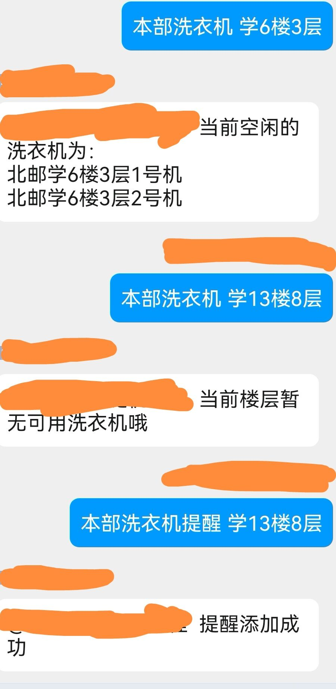

<div align="center">
  <a href="https://v2.nonebot.dev/store"></a>
  <br>
  <p></p>
</div>

<div align="center">

# nonebot-plugin-penguin-life
</div>

# 介绍
- 北京邮电大学本部/沙河校区胖乖生活洗衣机空闲状态查询及提醒


# 配置文件
## 必选内容
在Bot根目录下的.env文件中填入胖乖生活的token信息：
```
token = xxxxxxxx
```

# 使用方法
- (机器人命令)————(命令功能)
- 洗衣帮助————插件菜单
- 本部洗衣————查看本部空闲洗衣机
- 本部洗衣机 学X楼X层—————查看本部指定楼层洗衣机状态
- 本部洗衣机提醒 学X楼X层————设置洗衣机空闲提醒
- 雁北洗衣机————查看沙河雁北空闲洗衣机
- 雁南洗衣机————查看沙河雁南空闲洗衣机
  
# 插件效果
